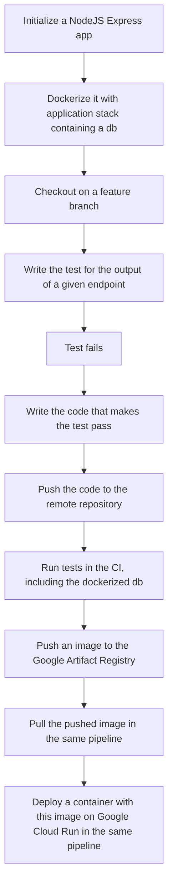

# GCP DevOps Workshop

Welcome to the `gcp_devops_workshop` !

This repo contains the code, organized in steps, of the DevOps workshop I usually present when talking about DevOps and the GCP.

The goal of this workshop is to introduce trainees to these concepts/tools by making them build a simple web API and gradually implement CI/CD pipelines; containerization, monitoring, etc.

This is an overview of the pipeline we'll be building:

You would navigate between the repo steps by checking out to the dedicated branch incrementally, e.g. git checkout step/x. You could fork the repo and go through the workshop that way, but I strongly recommend you'd create a repo from scratch and implement the steps one by one, using this repo as a reference: it's better for learning !

NOTE: the `main` branch is the most advanced. So, if you want to start from scratch, you can use the `step/0` branch.

Link to the wiki is available here => <https://github.com/yactouat/gcp_devops_workshop/wiki>

## Prerequisites

Node.js installed on your machine.
